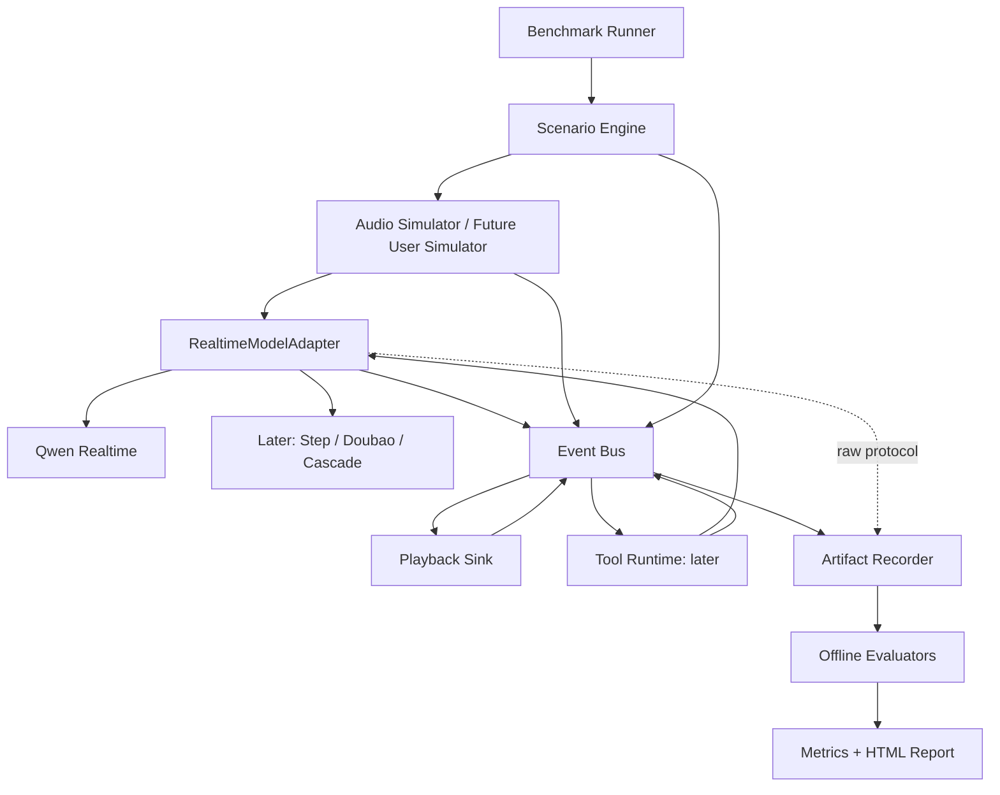

# Realtime Voice Agent Benchmark 架构提案

状态：核心事件、场景、Qwen/Seed Adapter、文本到冻结音频编译、Realtime runner、Agent
runtime 和离线 evaluator 已实现；Step 等未核验 provider 保持 deferred。本文描述架构和
证据边界，不记录实际测试内容或结果。

本项目评测中文完整语音 Agent，分别输出 Realtime、Agent、Response Quality 指标，不计算 Overall Score。第一版只接 Qwen 商业 Realtime，跑通少量 latency、interruption、user backchannel 场景。本文描述目标架构；当前可运行范围及命令见 [README](../README.md)。

阅读顺序：本文 → [事件契约](event-schema.md) → [指标与实施计划](benchmark-plan.md) → [Qwen 接入证据与验证计划](qwen-integration.md)。

## 1. 证据等级与当前仓库

文档使用以下标记，避免把 SDK 接口或示例误当成服务能力保证。

- **[源码验证]**：实际读取固定 commit 的源码、README 或仓库内官方文档。
- **[方案]**：本项目提出的设计，尚未实现。
- **[待实验]**：需要真实 API、录音、GPU 或标注实验确认。
- **[未核验]**：此次无法读取或材料不足，不能作为已验证事实。

设计调研时，工作目录没有业务文件、README、Python/Node 项目清单、锁文件或测试。隐藏目录 `.git`、`.agents`、`.codex` 均是只读空占位目录；没有发现适用的 `AGENTS.md`。`git status --short --branch` 返回“not a git repository”，因此不能声称工作区 clean，也不初始化或修改 Git 元数据。Phase 1 已建立项目清单、锁文件和独立 `.venv`，默认系统 Python 未修改。

| 环境项 | 实际检查结果 | 设计选择 |
|---|---|---|
| 默认 `python` / `python3` | 3.7.0 | 不作为项目解释器 |
| `python3.11` / `python3.12` | 3.11.16 / 3.12.14 | MVP 使用独立 Python 3.11 环境 |
| Node | v24.14.0 | Python MVP 不需要 Node 运行时 |
| uv | 0.12.6，已安装 | Phase 1 已建立 `pyproject.toml`、`.python-version`、`uv.lock` |
| poetry / 依赖文件 | 未发现 poetry；没有现有依赖配置 | 不继承任何上游工程环境 |
| uv 默认缓存 | 当前沙箱不可写；指定 `/tmp` 缓存后可列出已安装 Python | 实现时使用可写 cache，不修改系统 Python |

研究阶段只新增设计文档与无密钥的 `.env.example`。Phase 1 建立基础层，Phase 2 完成真实 Qwen 接入，Phase 3 增加后台录制、虚拟播放、latency runner/evaluator 及 10 条冻结 TTS。TTS SDK 仅为可选数据准备依赖；未下载模型权重，凭据未写入代码或工件。

## 2. 参考项目研究

### 2.1 固定资料版本

GitHub 源码浅克隆成功，研究副本在 `/tmp`，不纳入本仓库。网页搜索工具返回后端不支持的错误；阿里云帮助中心与 arXiv 网络请求遇到 TLS 错误。因此商业协议以官方代码和真实会话为已核验依据；没有声称读完帮助中心页面或全部论文。外部完整数据集未下载，数据覆盖规模若来自 README 会特别说明。

| 项目 | 研究 commit | 用途 |
|---|---|---|
| Full-Duplex-Bench | `3e799c45a045256f47d5f1c9cda90157e2d2ec9e` | 双工任务、时序标注、编排、工具调用 |
| EVA | `4cd0028b95111f72b33f53e9ef5c97241fe56238` | 多轮 Agent、状态校验、体验评价 |
| VCB-Bench | `542990571e5b6e3fbce4a318492aec5607aaee3c` | 中文真人语音、回答质量、鲁棒性 |
| 阿里云 speech demo | `1082942345c555429ee61c04b8c585f12e06dab2` | 音频、VAD、函数调用官方示例 |
| QwenAudio Agent | `149440d01d5f3ff4feaf2c6f904d05e6ac81d499` | Audio 3.0 smart-turn 与座舱工具时序 |

### 2.2 Full-Duplex-Bench 的演进及可借鉴内容

**v1 / v1.5 [源码验证]**

`v1_v1.5/dataset/README.md` 将样本组织为 `input.wav` 与任务注释 JSON；pause/turn-taking 注释包括 `text` 和秒级 `timestamp: [start, end]`。v1.5 的 overlap 样本提供 `clean_input.wav` 与干扰版，以及上下文文本、当前话语和重叠区间。这很适合借鉴为原始音频、标注、变体三者分离的资产格式。[数据说明][fdb-data]

`get_transcript/asr.py` 使用 Parakeet 输出 `{text, chunks: [{text, timestamp}]}`，并在截取 interruption 后的语音时加回时间偏移。可借鉴时间轴恢复方法，但该英文 ASR 路线不能直接当作中文标注真值。其模型推理脚本有并行发送/接收、输出补静音的设计，可作为保存音频时间线的参考。[ASR 源码][fdb-asr]

指标必须重新定义。`eval_smooth_turn_taking.py` 会把负延迟截为零；`eval_pause_handling.py`
使用固定时长和词数启发式条件。我们保留提前响应与失败样本，不移植英文词数阈值。
`eval_backchannel.py` 测模型作为 listener 的主动 backchannel；本项目测用户短确认语后助手是否
被错误打断，接近 v1.5 的 user backchannel 场景。[v1 指标目录][fdb-eval]

v1.5 的 `eval_behavior.py` 利用 clean/overlap 成对转写，将行为分为继续响应、恢复、处理不确定性等类别。我们借鉴成对实验与行为分项，保留 side conversation、ambient speech、simultaneous speech 独立标签，不将它们都标为 interruption。

**v2 [源码验证]**

`orchestrator.js` 用 WebSocket `/signal` 交换 WebRTC 信令，音频走 WebRTC；A 为 Examiner，B 为 Examinee。它维护双向音频缓冲并保存 A/B/combined WAV。实际默认桥接格式是 48 kHz mono PCM16；100 ms tick 内集中推送十个 10 ms frame。我们借鉴角色分离、独立音轨和会话编排，但不继承这种批量 pacing，也不为 MVP 引入 Node、WebRTC、LiveKit 全栈。[orchestrator][fdb-orchestrator]

`prompts_staged_200.json` 含 id、类别、examiner prompts、T1–T4 分阶段披露、skills、allow_barge_in 等；`eval/eval_single_item.py` 使用对话、时间片段和阶段目标离线打分。值得借鉴的是“场景目标与评分分离”，MVP 的 user simulator 先用可重放录音，未来才加入随机性更大的 bot-to-bot Examiner。[场景][fdb-v2-scenarios]、[离线评价][fdb-v2-eval]

**v3 [源码验证]**

`benchmark_data_v2.json` 含 dialogue、acting_notes、disfluency_features、expected_tool_calls、state_rollback_test、original/corrected 参数及 latency_profile；`$RESULT_0.field` 表达工具依赖。借鉴 FILLER、PAUSE、HESITATION、FALSE_START、SELF_CORRECTION 标签，以及调用链与修正前后参数。[场景模板][fdb-v3-data]

需要区分模板和录音规模：提交的 JSON 有 100 个 scenario 模板；README 声称发布录音为 100 examples、79 unique scenarios、12 speakers。此次没有下载外部录音验证其覆盖。

`mock_apis.py` 提供固定返回值和调用日志，但没有持久数据库；`evaluate_tool_calls.py` 以工具名多重集 F1 和参数匹配评价，参数 matcher 跳过 `$RESULT` 引用且不拒绝所有多余参数。`evaluate_pass_rate.py` 的 PASS 不能证明顺序正确或任务最终完成。本项目必须另做状态 oracle、严格类型校验、允许调用顺序与故障语义。[mock][fdb-mock]、[工具评价][fdb-tool-eval]

不直接移植 `latency_injector.py` 的未固定 seed 随机延迟、共享临时日志关联方案，以及 `livekit_inference.py` 固定为输入长度的输出缓冲。输出可能比输入长，接收间隙、取消前后音频都必须完整保存。

### 2.3 EVA

**[源码验证]** EVA 的 `orchestrator/worker.py` 启动每个场景的 assistant server 和 user simulator，收集多轮对话及音频；支持 Pipecat cascade 与多种 S2S server。它比 MVP 所需更重，但适合参考会话隔离、工件完整性和运行后评价。[worker][eva-worker]

`models/record.py` 的 `EvaluationRecord` 含 `id`、`user_goal`、`user_config`、`current_date_time`、`scenario_context`、`ground_truth.expected_scenario_db`、agent override。它将场景业务日期固定下来，对“明天/后天”的可重复评价很重要。[record schema][eva-record]

`assistant/tools/tool_executor.py` 统一记录调用→执行→结果，加载每场景 JSON 数据库，函数可以查询/改变状态。`metrics/accuracy/task_completion.py` 对规范化预期和实际最终数据库做 SHA-256 比较，同时检查会话认证字段，失败时生成字段级 diff。这是我们 Agent Task Completion 的主要参考。[executor][eva-tools]、[状态评价][eva-completion]

EVA-A 包括 deterministic task completion，以及 faithfulness、speech fidelity 等 judge 项；EVA-X 包括 turn taking、conciseness、conversation progression。不能把 EVA-A 全部称为确定性指标。其 conciseness rubric 考虑语音听者的信息负担、过度列举、重复，以及必要编号/确认信息的合理例外；可改编成中文口语 rubric。[指标说明][eva-readme]、[简洁度][eva-conciseness]

`user_simulator/perturbation.py` 提供 SNR 混音、连接劣化等；参考变体参数化和 clean/control 配对。`event_logger.py` 采用 JSONL + sequence，但使用 wall clock，不能直接承担本项目的 monotonic latency。随机 bot caller、上游英文企业领域工具、全套 judge 依赖不进入 MVP。工具格式正确率里“无调用=1”的约定也不用于判断必需工具任务成功。[扰动][eva-perturbation]

### 2.4 VCB-Bench

**[源码验证]** README 描述基于真人语音构建的中文评测，覆盖 instruction following、knowledge、multi-turn dialogue，以及 speaker/environment/content variations，鲁棒性子集有 `_cmp` 对照集。真人来源和完整数据规模尚未通过下载数据核验。[README][vcb-readme]

原始 dataset 使用 JSONL。`almeval/datasets/base.py` 声明每项的 `index`、`audio_path`（单路径或列表）、`question`、`answer`、`subset`；Audio-QA 另带 `audio_content` 供评价参考。loader 转为 `index`、`audio` 路径列表、`text`、`meta` 等模型输入，不同任务补充 `task_type`。`ds_mtturn.py` 使用 `mt_meta.rounds/this_round/score_ratio` 组织多轮评分，将 1–5 分 judge 按轮次权重汇总；缺失轮次分数的对话另统计 invalid。`run_audio.py` 支持仅推理、ASR 后评价和离线重新评价，结果保存 JSONL、prediction、输出音频路径及性能 JSON，适合参考 run/evaluate 解耦。[数据实现][vcb-datasets]、[入口][vcb-run]

`almeval/models/base.py` 的核心是整段 `generate_inner(msg)`；具体模型实现返回 prompt、文本、可选 `(sample_rate, waveform)`，入口再写音频文件。`task_type=audio2audio` 控制语音生成，多轮历史由输入音频与文本列表构建。这些是离线质量评测适配代码，并非能边听边说、带真实到达时间的 Realtime Adapter。[模型实现][vcb-models]

`ds_mqa.py`、`ds_refqa.py` 用任务相关的参考答案/judge 判语义准确性，不能称全部 deterministic。`ds_openqa.py` 支持开放题文字 judge 与音频 judge 分支，`metrics/ifeval.py` 提供 strict/loose 可验证指令规则。可以参考它们按任务选择证据的结构；其中某些 judge 调用 temperature=0.5，不能直接当成重复执行结果固定的评价器。[开放题评价][vcb-openqa]、[指令规则][vcb-ifeval]

采用其中文维度划分、成对鲁棒性样本、规则检查与 judge 分工。不要把文字 judge 的“详细”偏好直接用于语音回答，也不要将模型自己输出的文本视为已说出的音频全文；语音内容使用独立 ASR，并记录 ASR 来源、版本和不确定性。环境扰动/说话人变体的结果不应混入 clean realtime latency。

### 2.5 复用边界

| 项目 | 采用的设计 | 不直接采用的实现 |
|---|---|---|
| FDB | 时间窗标注、clean/overlap 对照、Examiner/Examinee、disfluency 与调用链 | wall-clock latency、英语阈值、整个 LiveKit/Node 工程、工具集合 PASS 当任务完成 |
| EVA | 每场景状态隔离、固定业务时间、最终状态 diff、调用审计、语音体验 rubric | 默认外部 bot caller/多 judge 服务、企业域工具全集、wall-clock logger |
| VCB | 中文质量分类、音频资产与任务字段、离线重评、鲁棒性配对 | 整段生成接口充当实时协议、文本表现替代语音表现 |
| Qwen 官方 | 实际 SDK/示例协议、输入输出格式、部署接口 | demo 清队列策略当模型语义能力、SDK 内置延迟当本项目 TTFA |

许可证也需按代码/数据区分。FDB 根目录为 CC BY-NC 4.0，dataset README 对部分 synthetic/v1.5 数据声明 MIT，Candor/ICC 另有上游条款；EVA 根代码 MIT；VCB 代码 Apache-2.0 并附第三方条款；阿里云 demo 为 MIT。当前只借鉴设计，未复制实现；后续若引入代码/数据，逐文件核对声明并保留出处。数据许可不能由代码许可推定。

## 3. Proposed Architecture [方案]



Runner 只处理通用配置、生命周期、能力检查、预算和超时。协议、认证、厂商事件名只在 adapter 内出现。Event Bus 是同一进程内的异步通道，无需消息中间件；raw recorder 接口是通用的 `RawTraceSink`，Runner 不解析 raw 内容。

### 模块职责

| 模块 | 职责与边界 |
|---|---|
| `benchmark/run.py` | suite/case 调度、run/case/attempt ID、并发限制、最终状态；默认一次一个 case；按 category 分派 latency/interruption |
| `scenarios/` + scenario loader | YAML 数据、版本/哈希校验、前置条件、事件触发、终止条件；无厂商协议 |
| `simulator/` | 按单调时钟发送 PCM，记录计划/实际时间、混音、静音、预录音/TTS 资产；不依据答案控制模型 |
| `adapters/base.py` | 音频、会话、工具结果、取消的异步契约及能力声明 |
| `adapters/qwen/` | 商业 Qwen 协议、raw→normalized、关联 ID；采用已核验协议的异步 WebSocket transport |
| `events/` | schema、时钟、事件分发、append-only recorder；不包含指标规则 |
| `simulator/playback.py` | 接收音频缓冲、按样本消费、取消/丢弃审计、播放时间轴；MVP 可无声卡运行 |
| `tools/` | deterministic weather/train/calendar、严格校验、call_id 幂等、故障注入、状态快照与执行事件 |
| `evaluator/` | 仅消费工件；Realtime/Agent/Quality 分离；每项含版本、分母、证据事件 |
| `reports/` | HTML 模板及生成器；结果写 `runs/`，不写入模板目录 |
| `dataset/` | 校验文本 corpus/scenario，将文本动作编译为现有 runtime Scenario；保存 compilation manifest |
| `renderers/` | 会话外 TTS provider 抽象与 Qwen 实现；输出统一 PCM，不接触 benchmark runner |
| `datasets/` | 音频、标注、manifest 与许可信息；不在每次运行重新 TTS |
| `configs/` | 模型/session/evaluation profiles；只引用环境变量名 |
| `tests/` | 事件 fixtures、fake transport、计时与状态反例及工具闭环；默认不调用收费 API |

初期只创建用到的模块。Step、Doubao、Cascade 到对应阶段再建，避免先堆空实现。

### Phase 4 已实现的边界

双轮输入串行使用同一个 PCM 流，第一轮尾部静音可在响应触发后停止；接收、虚拟播放和录制继续并行。trigger deadline 绑定原事件时间，前置条件按本地收到且未消费的 PCM 检查，观测结束与后置 close/drain 分开记录。取消以 response ID 定位，播放样本与丢弃样本分别引用原 PCM。

离线 evaluator 0.3 校验前置条件、时间误差及封口完整性，输出 censored、unknown 和有效分母。新回答的生成文本与播放完成分别判断，截断不能仅凭全文转写记 pass。原始工件不回写，evaluation 身份包含 evaluator 及共享 schema/replay/config 的源码哈希。多 category 当前在执行前拒绝，不混合计分。

### Agent 执行边界（2026-09-20）

`agent.runtime` 接收冻结音频，通过统一 Adapter 接收工具事件，执行 Mock Tools 并回传结果。runtime 不读取 expected_calls 或预期最终状态。`agent.evaluate` 先验证封口哈希，再按实际事件和故障计划重放状态，最后比较 oracle。旧标准答案驱动的脚本已移除；后续禁止恢复该路径。工具调用、执行结果和语音输出均落统一事件及工件。异步 tool delay 允许期间发送修正音频；Qwen 旧工具结果注入后，若已有新用户回合则不重启旧回答。步骤结果依赖在离线阶段按 tool_result_sent → tool_call_start 时序验证，详见 [Agent 实现](agent-implementation.md)。

### 并发与生命周期

每 case 创建独立会话。接收、音频发送、事件分发、播放、持久化并行运行，SDK 阻塞调用放在线程边界；不能在接收回调里执行工具、ASR 或磁盘大写入。回调入口先捕获时间，随后入队。

使用有界队列与记录的高水位。测量期间若 recorder/transport 背压导致发送严重延后，写 `error` 和 protocol violation，结束或将 case 标为 invalid；不悄悄丢事件或补发一整段音频。cancel 与 close 也有超时；取消后仍接收可能迟到的音频并标记，不让旧 response 音频混入新 response。

状态为 `created → connected → configured → running → draining → closed`；异常路径进入 `failed` 后保存 partial artifacts。不在同一次 attempt 中自动重连伪装连续对话；重试新建 attempt，旧失败仍留在统计。完成条件是场景终止规则、响应状态与播放/接收收尾共同满足，不能固定“等输入长度那么久”。

### 文本输入编译层（2026-09-21）

`text_corpus` 是便于维护的作者格式，分为单动作半双工和事件触发的两动作全双工。编译器在任何 target adapter 连接前完成整套 TTS，生成内容寻址 WAV、渲染 metadata、runtime Scenario 和 manifest。TTS 耗时不进入实时指标；target model 只看到 PCM。

TTS renderer 与 `RealtimeModelAdapter` 是两条独立扩展轴。增加 target model 不应重新合成输入；增加 TTS provider 也不能把协议写进 runner。完整字段和运行方式见 [文本测试集说明](text-dataset.md)。

## 4. Adapter Interface [方案]

下列公共契约已在 Phase 1 实现，见 [adapters/base.py](../adapters/base.py)。具体数据字段见 [事件文档](event-schema.md)。子类实现 `_connect`、`_configure` 等 transport hooks，公共方法负责生命周期约束。

```python
class RealtimeModelAdapter:
    async def connect(self) -> SessionInfo: ...
    async def configure(self, config: SessionConfig) -> EffectiveConfig: ...
    async def send_audio(self, frame: AudioFrame) -> SendReceipt: ...
    async def commit_turn(self, turn_id: str) -> None: ...
    async def receive_event(self) -> EventDraft: ...
    async def send_tool_result(self, result: ToolResult) -> None: ...
    async def interrupt(self, request: InterruptRequest) -> CommandReceipt: ...
    async def close(self) -> None: ...
    def capabilities(self) -> CapabilityManifest: ...
```

- `AudioFrame` 含 PCM bytes、sample rate/channels/encoding、stream/turn/chunk ID、sample offset。内部统一 PCM16 little-endian；每后端协商实际采样率，在发送前重采样并保存精确变换。`SendReceipt` 仅证明本地 transport 已接受该帧，不证明服务端已经处理。
- `commit_turn` 补充原始接口中缺失的手动结束输入语义。manual 模式由 adapter 映射 commit/create；server VAD 模式通常不调用，禁止重复提交。
- `receive_event` 单消费者，返回已捕获观测时间的 `EventDraft`；录制器分配 seq，记录入口时间由后台队列提交时捕获，形成 `NormalizedEvent`。关闭后允许排空至 EOF。Phase 3 runner 注入 `BufferedArtifacts`，PCM 引用立即预留、raw/PCM/normalized 按 FIFO 后台写入，网络收发与虚拟播放不等待磁盘。JSONL 仅存音频引用。旧 connection probe 仍保留同步落盘行为，仅作连接诊断。
- `interrupt` 是显式客户端控制命令，返回发送回执而非模型已取消。自然打断测试只发送音频，不按场景标签调用它。取消范围、播放清理、上下文截断是否可用由能力与 profile 决定。
- `send_tool_result` 只注入结果并按后端要求恢复 response；工具的选择、参数、执行、数据库与评价均在通用层。
- `configure` 记录 requested/effective/unverified 三类参数；服务端未回显的参数不能自称已确认。配置无法确认时必须标明限制或令 strict profile 失败。
- `close` 幂等，等待有界收尾；意外断开也生成一次 session_end，原因必须保留。

能力 manifest 对 `streaming_input/output`、`audio_input/output`、`server_vad`、`native_full_duplex`、`native_interrupt`、`client_cancel`、`tool_calling`、`tool_result_injection`、`context_truncation`、`playback_ack` 分别记 `supported / unsupported / unknown`、证据来源和 `docs / experiment` 状态。能力只用于合法性检查；不能因为 backchannel 表现差就把它改成 unsupported 来移除失败样本。

## 5. Artifact Directory Layout [方案]

```text
runs/<run_id>/
  config.json                  # resolved config，已去除凭据
  manifest.json                # 版本、hash、attempt 索引、完整性与运行状态
  metrics.json                 # 此次默认评价的聚合导出
  report.html                  # 默认评价的静态报告
  cases/<scenario_id>/<attempt_id>/
    config.json
    scenario.yaml              # 冻结后的输入；oracle 不发给模型
    manifest.json
    input.wav                  # 实际发送的单声道时间线，含静音与混音
    output.wav                 # playback sink 实际消费的时间线
    raw_events.jsonl            # 双向厂商事件，带时间戳与 blob 引用
    events.jsonl                # 统一事件，源事实
    transcript.json            # 由事件/ASR 派生；标明来源
    audio/received/<response_id>.pcm
    audio/input_assets/        # 资产副本或可解析内容寻址引用
    blobs/                     # raw base64/binary 原文与 hash
    tools/calls.jsonl           # Agent 阶段启用
    tools/results.jsonl
    tools/initial_state.json
    tools/final_state.json
    metrics.json
  evaluations/<evaluation_id>/ # 保留各 evaluator/config 版本的重评结果
    config.json
    metrics.json
    report.html
```

单 case 时在 run 根提供指向该 case 的 input/output/raw/events/transcript 的相对链接或同内容导出，以满足用户期待的简洁目录；多 case 时这些同名文件只在 case 下，不把多会话音频拼接成可用于 latency 的一段。run 根 metrics/report 始终是聚合层。

`output.wav` 在 MVP 是 **virtual playback** 时间线，不声称为声卡实测。所有收到但被丢弃的音频仍保留在 `audio/received/`，mapping 记录 received sample → played/dropped sample。单纯把 response chunks 串联成 WAV 会丢掉网络间隙，不足以重建实际播放。

manifest 保存模型名/返回版本、adapter version、SDK/后端 commit、API endpoint/profile、API version（未公开则 null + 原因）、voice、temperature、sampling、VAD、系统 prompt hash、场景/音频/工具 fixture hash、seed、音频格式、播放策略、chunk size、操作系统/Python、时钟信息、代码 revision（当前无 Git 则 null）。请求参数和生效参数分别记录。不记录 API key、认证头、带凭据 URL。

raw 不等于无过滤保存秘密：认证字段剔除，音频 base64 可无损外置，记录原字段位置及 hash 以重建；未知厂商事件照常落盘。每次评价保存 evaluator version、配置、输入工件 hash 与逐项证据；源事件不因重评覆盖。

## 6. Reproducibility 与扩展边界

重复性指输入资产、工具世界、控制策略、评价算法相同；远程模型与网络不保证逐 bit 相同。TTS 提前生成、试听并冻结，记录 speaker/语速/供应商/模型/许可，不在基准循环里现生成。正式报告同时给 repeated attempts、模型别名变化、网络位置与时间段。

多轮、pause、overlap 使用同一 scenario action/trigger 契约；noise 为预处理 transform，包含 seed、noise hash、截取位置、SNR 算法、限幅策略与实测 SNR。后续 bot-to-bot 用户模拟单独列 experiment track，固定 prompt 也不能声称行为完全确定。

Mock Tool Runtime 先在进程内提供确定性服务契约，未来如需 HTTP 增加薄 transport。领域仅 weather/train/calendar。每 attempt 独立状态、固定业务日期、确定 ID、严格参数 schema、审计日志、预设调用序号故障、事务/幂等规则。HTTP 500 在进程内表示为结构化 transport fault，接入 HTTP 时才产生真实 HTTP 响应。工具协议不能依赖 Qwen。

查询任务不能靠“数据库没变化”直接判成功：还必须有正确调用/结果与答案断言。写入任务检查最终状态与禁止副作用。Correction、tool timeout 后迟到结果等竞态规则见 [Agent 计划](benchmark-plan.md#5-agent-阶段设计)。

## 7. 风险与尚待确认事项

| 风险/未知 | 影响 | 处理与验证 |
|---|---|---|
| Qwen 不同账户/区域的可用模型 | 示例配置不保证全部可用 | 已验证北京 endpoint 的 Audio 3.0 Flash；其他组合仍逐项 probe |
| VAD 会不会对短确认语取消，是否独立支持语义打断 | Backchannel 指标可能很差或证据不足 | 行为结果原样报告；不按 ground truth 控制 cancel |
| 取消确认、晚到音频、服务端上下文裁剪 | Stop latency 和新意图理解易混淆 | response/item/call ID、播放审计、取消来源与上下文能力逐项验证 |
| 客户端没有服务端阶段耗时 | 无法纯粹拆出模型/TTS 耗时 | 只报 client-observed 分解，内部耗时 unavailable |
| 样本每类仅 10 个 | P95/P99 不稳定 | 显示 n、失败率及原始值，不宣传为稳定排行 |
| 中文 ASR 与音频语义不一致 | Context switch/quality 判定可能偏差 | 独立 ASR + 抽听；不确定结果允许 unknown |
| 当前无有效 Git 元数据 | 无法取得代码 revision/生成 git diff | 留空原因；不主动修复 Git 元数据 |

Qwen Audio 3.0 协议依据见 [Qwen 接入](qwen-integration.md) 与
[座舱 Benchmark](cockpit-benchmark.md)。Interruption、Backchannel 和 duplex 继续共享
同一事件与评价契约；其他供应商必须在各自 adapter 内完成协议核验。

[fdb-data]: https://github.com/DanielLin94144/Full-Duplex-Bench/blob/3e799c45a045256f47d5f1c9cda90157e2d2ec9e/v1_v1.5/dataset/README.md
[fdb-asr]: https://github.com/DanielLin94144/Full-Duplex-Bench/blob/3e799c45a045256f47d5f1c9cda90157e2d2ec9e/v1_v1.5/get_transcript/asr.py
[fdb-eval]: https://github.com/DanielLin94144/Full-Duplex-Bench/tree/3e799c45a045256f47d5f1c9cda90157e2d2ec9e/v1_v1.5/evaluation
[fdb-orchestrator]: https://github.com/DanielLin94144/Full-Duplex-Bench/blob/3e799c45a045256f47d5f1c9cda90157e2d2ec9e/v2/orchestrator.js
[fdb-v2-scenarios]: https://github.com/DanielLin94144/Full-Duplex-Bench/blob/3e799c45a045256f47d5f1c9cda90157e2d2ec9e/v2/prompts_staged_200.json
[fdb-v2-eval]: https://github.com/DanielLin94144/Full-Duplex-Bench/blob/3e799c45a045256f47d5f1c9cda90157e2d2ec9e/v2/eval/eval_single_item.py
[fdb-v3-data]: https://github.com/DanielLin94144/Full-Duplex-Bench/blob/3e799c45a045256f47d5f1c9cda90157e2d2ec9e/v3/benchmark_data_v2.json
[fdb-mock]: https://github.com/DanielLin94144/Full-Duplex-Bench/blob/3e799c45a045256f47d5f1c9cda90157e2d2ec9e/v3/mock_apis.py
[fdb-tool-eval]: https://github.com/DanielLin94144/Full-Duplex-Bench/blob/3e799c45a045256f47d5f1c9cda90157e2d2ec9e/v3/evaluate_tool_calls.py
[eva-worker]: https://github.com/ServiceNow/eva/blob/4cd0028b95111f72b33f53e9ef5c97241fe56238/src/eva/orchestrator/worker.py
[eva-record]: https://github.com/ServiceNow/eva/blob/4cd0028b95111f72b33f53e9ef5c97241fe56238/src/eva/models/record.py
[eva-tools]: https://github.com/ServiceNow/eva/blob/4cd0028b95111f72b33f53e9ef5c97241fe56238/src/eva/assistant/tools/tool_executor.py
[eva-completion]: https://github.com/ServiceNow/eva/blob/4cd0028b95111f72b33f53e9ef5c97241fe56238/src/eva/metrics/accuracy/task_completion.py
[eva-readme]: https://github.com/ServiceNow/eva/blob/4cd0028b95111f72b33f53e9ef5c97241fe56238/README.md
[eva-conciseness]: https://github.com/ServiceNow/eva/blob/4cd0028b95111f72b33f53e9ef5c97241fe56238/docs/metrics/conciseness.md
[eva-perturbation]: https://github.com/ServiceNow/eva/blob/4cd0028b95111f72b33f53e9ef5c97241fe56238/src/eva/user_simulator/perturbation.py
[vcb-readme]: https://github.com/Tencent/VCB-Bench/blob/542990571e5b6e3fbce4a318492aec5607aaee3c/README.md
[vcb-datasets]: https://github.com/Tencent/VCB-Bench/tree/542990571e5b6e3fbce4a318492aec5607aaee3c/almeval/datasets
[vcb-run]: https://github.com/Tencent/VCB-Bench/blob/542990571e5b6e3fbce4a318492aec5607aaee3c/run_audio.py
[vcb-models]: https://github.com/Tencent/VCB-Bench/tree/542990571e5b6e3fbce4a318492aec5607aaee3c/almeval/models
[vcb-openqa]: https://github.com/Tencent/VCB-Bench/blob/542990571e5b6e3fbce4a318492aec5607aaee3c/almeval/datasets/ds_openqa.py
[vcb-ifeval]: https://github.com/Tencent/VCB-Bench/blob/542990571e5b6e3fbce4a318492aec5607aaee3c/almeval/metrics/ifeval.py
